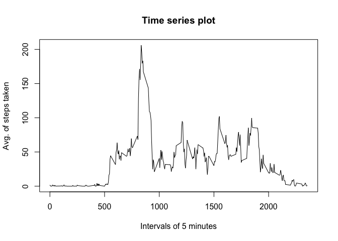
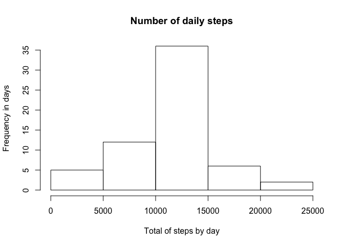
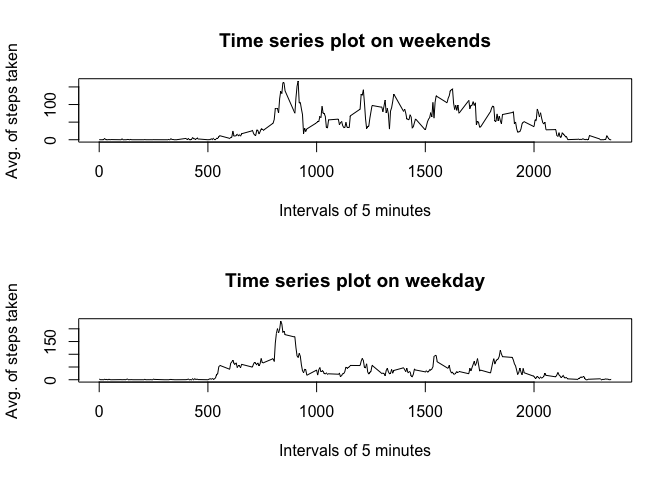

# Reproducible Research: Peer Assessment 1


## Loading and preprocessing the data

```r
if (!file.exists("repdataActivity.zip")) {
  download.file("https://d396qusza40orc.cloudfront.net/repdata%2Fdata%2Factivity.zip",
    "repdataActivity.zip", method = "curl")
}

if (!file.exists("activity.csv")) {
  unzip("repdataActivity.zip")
}

activityData <- read.csv("activity.csv")
activityData$date <- as.Date(activityData$date)
```
## What is mean total number of steps taken per day?
### Calculate the total number of steps taken per day:

```r
activityDataAggregatedByDate <- aggregate(steps~date, activityData, sum)
activityDataAggregatedByDate
```

```
##          date steps
## 1  2012-10-02   126
## 2  2012-10-03 11352
## 3  2012-10-04 12116
## 4  2012-10-05 13294
## 5  2012-10-06 15420
## 6  2012-10-07 11015
## 7  2012-10-09 12811
## 8  2012-10-10  9900
## 9  2012-10-11 10304
## 10 2012-10-12 17382
## 11 2012-10-13 12426
## 12 2012-10-14 15098
## 13 2012-10-15 10139
## 14 2012-10-16 15084
## 15 2012-10-17 13452
## 16 2012-10-18 10056
## 17 2012-10-19 11829
## 18 2012-10-20 10395
## 19 2012-10-21  8821
## 20 2012-10-22 13460
## 21 2012-10-23  8918
## 22 2012-10-24  8355
## 23 2012-10-25  2492
## 24 2012-10-26  6778
## 25 2012-10-27 10119
## 26 2012-10-28 11458
## 27 2012-10-29  5018
## 28 2012-10-30  9819
## 29 2012-10-31 15414
## 30 2012-11-02 10600
## 31 2012-11-03 10571
## 32 2012-11-05 10439
## 33 2012-11-06  8334
## 34 2012-11-07 12883
## 35 2012-11-08  3219
## 36 2012-11-11 12608
## 37 2012-11-12 10765
## 38 2012-11-13  7336
## 39 2012-11-15    41
## 40 2012-11-16  5441
## 41 2012-11-17 14339
## 42 2012-11-18 15110
## 43 2012-11-19  8841
## 44 2012-11-20  4472
## 45 2012-11-21 12787
## 46 2012-11-22 20427
## 47 2012-11-23 21194
## 48 2012-11-24 14478
## 49 2012-11-25 11834
## 50 2012-11-26 11162
## 51 2012-11-27 13646
## 52 2012-11-28 10183
## 53 2012-11-29  7047
```

### Make a histogram of the total number of steps taken each day:

```r
hist(activityDataAggregatedByDate$steps, xlab="Total of steps by day", ylab="Frequency in days",main="Number of daily steps")
```

 

### Calculate and report the mean and median of the total number of steps taken per day:

```r
mean(activityDataAggregatedByDate$steps, na.rm = TRUE)
```

```
## [1] 10766.19
```

```r
median(activityDataAggregatedByDate$steps, na.rm = TRUE)
```

```
## [1] 10765
```


## What is the average daily activity pattern?
### Make a time series plot (i.e. type = "l") of the 5-minute interval (x-axis) and the average number of steps taken, averaged across all days (y-axis)

```r
activityDataAggregatedMeanByInterval <- aggregate(steps~interval, activityData, mean)
plot(activityDataAggregatedMeanByInterval, type = "l", xlab = "Intervals of 5 minutes", ylab = "Avg. of steps taken", main = "Time series plot")
```

 

### Which 5-minute interval, on average across all the days in the dataset, contains the maximum number of steps?

```r
activityDataAggregatedMeanByInterval$interval[which.max(activityDataAggregatedMeanByInterval$steps)]
```

```
## [1] 835
```

## Imputing missing values

### Calculate and report the total number of missing values in the dataset (i.e. the total number of rows with NAs)

```r
sum(is.na(activityData$steps))
```

```
## [1] 2304
```

### Devise a strategy for filling in all of the missing values in the dataset. The strategy does not need to be sophisticated. For example, you could use the mean/median for that day, or the mean for that 5-minute interval, etc.
Strategy being used: mean for that day

### Create a new dataset that is equal to the original dataset but with the missing data filled in.

```r
filledActivityData <- merge(activityData, activityDataAggregatedMeanByInterval, by="interval", suffixes=c("",".y"))
naSteps <- is.na(filledActivityData$steps)
filledActivityData$steps[naSteps] <- filledActivityData$steps.y[naSteps]
filledActivityData <- filledActivityData[,c(1:3)]
```

### Make a histogram of the total number of steps taken each day and Calculate and report the mean and median total number of steps taken per day.

```r
filledActivityDataAggregated <- aggregate(steps~date, filledActivityData, sum)
hist(filledActivityDataAggregated$steps, xlab="Total of steps by day", ylab="Frequency in days",main="Number of daily steps")
```

 

```r
mean(filledActivityDataAggregated$steps, na.rm = TRUE)
```

```
## [1] 10766.19
```

```r
median(filledActivityDataAggregated$steps, na.rm = TRUE)
```

```
## [1] 10766.19
```

#### Do these values differ from the estimates from the first part of the assignment?
Yes. They are slightly higher.

#### What is the impact of imputing missing data on the estimates of the total daily number of steps?
Since we're working with the mean value and the values overall are lower than the mean value, the impact will be that there'll be more steps counted, like fake steps, and the plot will be a little higher.

## Are there differences in activity patterns between weekdays and weekends?

#### Create a new factor variable in the dataset with two levels ??? ???weekday??? and ???weekend??? indicating whether a given date is a weekday or weekend day.

```r
filledActivityData$weekpart <- weekdays(as.Date(filledActivityData$date), TRUE)
filledActivityData$weekpart[filledActivityData$weekpart %in% c("Sat", "Sun")] <- "weekend"
filledActivityData$weekpart[filledActivityData$weekpart != "weekend"] <- "weekday"
```

#### Make a panel plot containing a time series plot (i.e. type = "l") of the 5-minute interval (x-axis) and the average number of steps taken, averaged across all weekday days or weekend days (y-axis).

```r
par(mfrow=c(2,1))
plot(aggregate(steps~interval, filledActivityData, mean, subset = filledActivityData$weekpart=="weekend"), type = "l", xlab = "Intervals of 5 minutes", ylab = "Avg. of steps taken", main = "Time series plot on weekends")
plot(aggregate(steps~interval, filledActivityData, mean, subset = filledActivityData$weekpart=="weekday"), type = "l", xlab = "Intervals of 5 minutes", ylab = "Avg. of steps taken", main = "Time series plot on weekday")
```

 
